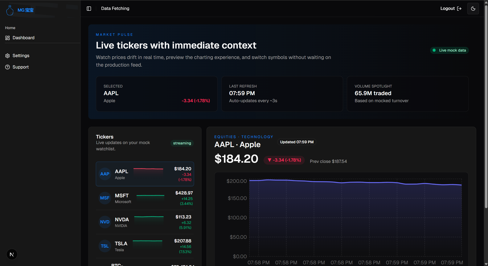
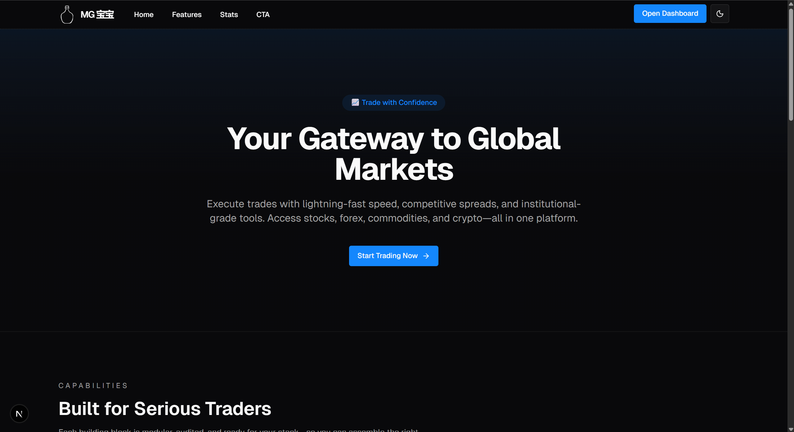
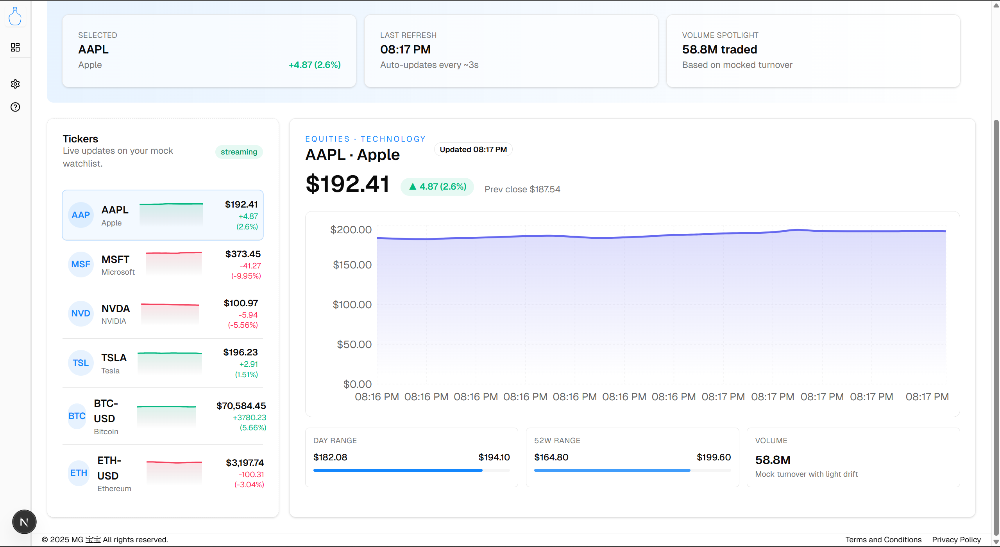
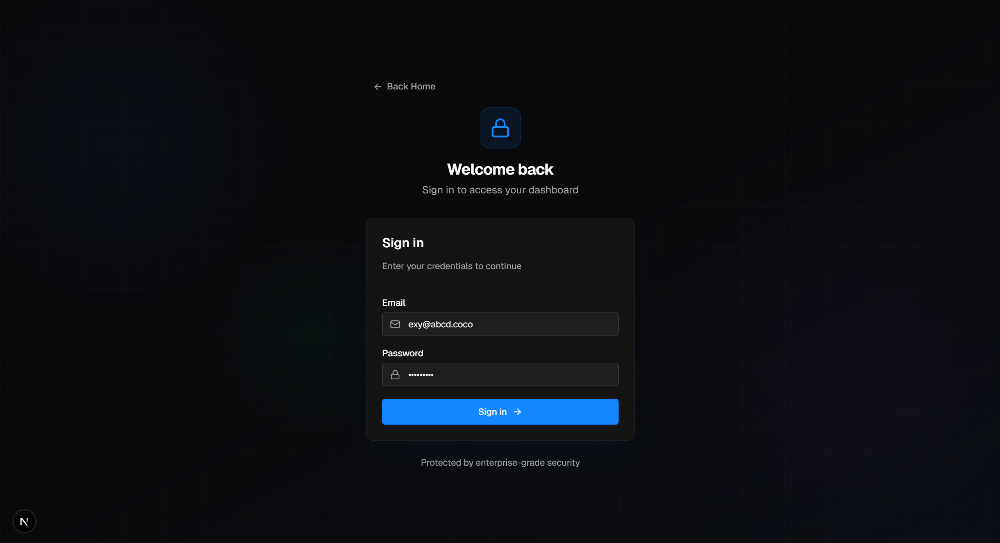

# MG-Test

A full-stack application built with a modern monorepo architecture.

---

## 📸 Screenshots

<table>
  <tr>
    <td align="center">
      
      <br/>
      <em>Main Dashboard</em>
    </td>
    <td align="center">
      
      <br/>
      <em>Home Page</em>
    </td>
  </tr>
  <tr>
    <td align="center">
      
      <br/>
      <em>Dashboard View</em>
    </td>
    <td align="center">
      
      <br/>
      <em>Login Page</em>
    </td>
  </tr>
</table>

---

## 🏗️ Architecture

```
┌─────────────────────────────────────────────────────────────────┐
│                         Client (Browser)                        │
└─────────────────────────┬───────────────────────────────────────┘
                          │
          ┌───────────────┼───────────────┐
          ▼               ▼               ▼
    ┌───────────┐   ┌───────────┐   ┌───────────┐
    │  Web App  │   │    API    │   │  Socket   │
    │  Next.js  │──▶│  NestJS  |◀──│  Gateway  |
    │   :3000   │   │   :3002   │   │   :3003   │
    └───────────┘   └───────────┘   └─────┬─────┘
                                          │
                                    ┌─────▼─────┐
                                    │   Redis   │
                                    │   :6379   │
                                    └───────────┘
```

---

## 📁 Monorepo Structure

This project uses **pnpm workspaces** and **Turborepo** for monorepo management.

```
mg-test/
├── apps/                    # Deployable applications
│   ├── web-app/            # Next.js 16 frontend
│   ├── back-end/           # NestJS REST API
│   └── socket-gateway/     # NestJS WebSocket server
│
├── packages/                # Shared libraries
│   ├── ui/                 # React component library (shadcn/ui)
│   └── white-label/        # Branding
│
├── tooling/                 # Build configuration
│   └── tsconfig/           # Shared TypeScript configs
│
├── k8s/                     # Kubernetes manifests
├── scripts/                 # Deployment scripts
└── turbo.json              # Turborepo config
```

---

## 📦 Apps & Packages

| Name | Type | Description |
|------|------|-------------|
| `apps/web-app` | Frontend | Next.js 16, React 19, TailwindCSS, shadcn/ui, Socket.io |
| `apps/back-end` | REST API | NestJS 11, JWT auth, request validation |
| `apps/socket-gateway` | WebSocket | NestJS 11, Socket.io, Redis adapter for scaling |
| `packages/ui` | Library | Shared React components (shadcn/ui based) |
| `packages/white-label` | Library | Branding |
| `tooling/tsconfig` | Config | Shared TypeScript configurations |

---

## 🚀 Getting Started

### Prerequisites

**Node.js:** 24.11.1+ / **pnpm:** 10.19.0+ / **Docker:** (for containerized deployment)

### Installation

```bash
# Clone the repository
git clone <repository-url>
cd mg-test

# Install dependencies
pnpm install

# Copy environment file
cp .env.example .env
# Edit .env with your values
```

### Development

```bash
# Start all apps in development mode
pnpm dev
```

### Build

```bash
# Build all apps
pnpm build
```

---

## ☸️ Deployment: Kubernetes

For production deployments with auto-scaling and high availability.

### Quick Start

```bash
# set the context
kubectl config use-context docker-desktop

# Deploy to Docker Desktop
./scripts/k8s-deploy.sh
```

### Scaling

Auto-scaling is configured for all services:

| Service | Min | Max | Scale Trigger |
|---------|-----|-----|---------------|
| api | 1 | 5 | CPU > 70% or Memory > 80% |
| socket | 1 | 5 | CPU > 70% or Memory > 80% |
| web | 1 | 3 | CPU > 70% or Memory > 80% |

Check HPA status:
```bash
kubectl -n mg-test get hpa
```

### Secrets Configuration

Before deploying, update the secrets in `k8s/secrets.yaml`:

```yaml
# k8s/secrets.yaml
apiVersion: v1
kind: Secret
metadata:
  name: mg-test-secrets
  namespace: mg-test
type: Opaque
stringData:
  JWT_SECRET: "your-production-jwt-secret"
  REDIS_PASSWORD: "your-redis-password"
```

After updating secrets, apply and restart:
```bash
kubectl apply -k k8s/
kubectl -n mg-test rollout restart deployment/api deployment/socket deployment/web
```

### Cleanup

```bash
./scripts/k8s-delete.sh
# or
kubectl delete -k k8s/
```

---

## ⚙️ Environment Variables

### Required Variables

| Variable | Description | Example |
|----------|-------------|---------|
| `PORT` | API port | `3002` |
| `JWT_SECRET` | JWT signing secret | `your-secret` |
| `GATEWAY_PORT` | Socket gateway port | `3003` |
| `AUTH_INTROSPECT_URL` | Auth endpoint for socket | `http://api:3002/auth/introspect` |
| `AUTH_INTROSPECT_CACHE_TTL_MS` | Auth cache TTL | `30000` |
| `REDIS_URL` | Redis connection URL | `redis://:pass@redis:6379` |
| `REDIS_PASSWORD` | Redis password | `your-password` |
| `WEB_PORT` | Web app port | `3000` |
| `NEXT_PUBLIC_BACKEND_URL` | API URL for browser | `http://localhost:3002` |
| `NEXT_PUBLIC_SOKCET_GETWAY_URL` | Socket URL for browser | `http://localhost:3003` |

---

## 📄 License

MIT
